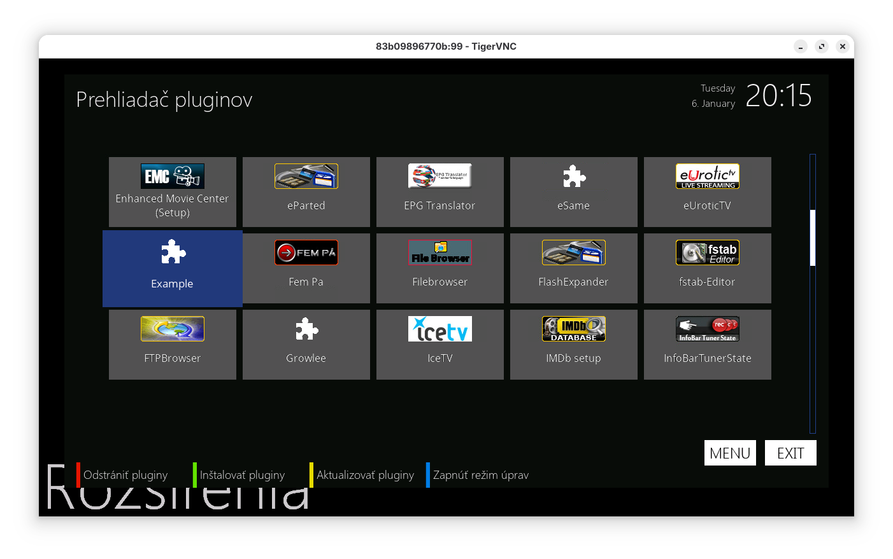
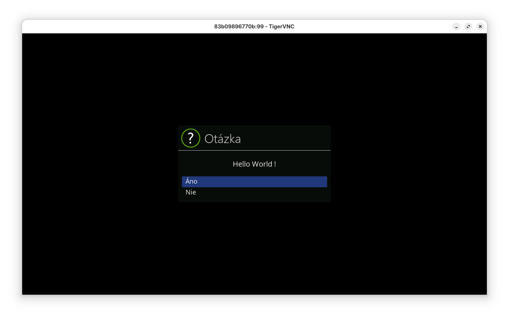

> Forked from https://github.com/technic/enigma2_example

# Enigma2 plugins development in VS Code with Docker
This setup allows to easily develop python [enimga2](https://www.opena.tv) plugins under Windows or Linux. In this guide I will explain how it works.

This guide may become obsolete because of new [feature](https://code.visualstudio.com/blogs/2019/05/02/remote-development).

## Installing Dependencies
You will need the following tools:

- The IDE, that will provide easy source navigation, auto-completion, linting and debugging. We will use  [Visual Studio Code](https://code.visualstudio.com/).
- Of course we will need [python extension](https://code.visualstudio.com/docs/languages/python) for VS Code.
- Python interpreter, required for IDE to be able to work with local source files. On Windows you can download it from [python.org](https://www.python.org/).
- [Docker](https://www.docker.com/) containerization software, required to run enigma2 isolated.
- VNC client to connect to enigma2 GUI. Under Windows [VNC Viewer](https://www.realvnc.com/en/connect/download/viewer/) looks nice.

## Creating Project
To begin with, create new directory and open it in VS Code. It will be your "Workspace". I suggest to create the `src` sub-directory where python sources such as `plugin.py` will be located. Initialize a git or other VCS system of your choice (if you like).

### Python virtual environment

It is considered to be a good practice to create python virtual environment for different projects. I prefer to use [pipenv](https://docs.pipenv.org) for this purpose, which is combination of `pip` and `virtualenv`. 

Initialize virtual environment with `pipenv install`. The default `Pipfile` will be created. Currently enigma2 sources are using Python 2 standard, make sure you have the correct python version. Select new virtual environment as your python interpreter in the VS Code by clicking on "Python" button in the bottom left. You would notice several popups suggesting to install necessary python packages, go ahead. 

*NOTE:* You may want to first create `.venv` folder under the project root, otherwise virtual environment will end up under your home directory.

### VS Code user hints

If you are not familiar with VS Code yet the main point is to learn `Ctrl+Shift+P` shortcut that opens a command prompt and you can just type things you want to do.

You will notice that there is a `.vscode` folder created in your workspace, with the settings. We will modify them later.

## IDE Source navigation
Download enigma2 source code from [git](https://github.com/openatv/enigma2). For example put it adjacent to the project workspace root location. Create the `.env` file in order to tell the IDE where it can find necessary imports. In my case the relative path is:
```
PYTHONPATH=../enigma2/lib/python;../enigma2
```
Now IDE restart ("Reload window") is required. Create a `src/plugin.py`, start typing what every plugin should have:
```python
from Plugins.Plugin import PluginDescriptor
```
... enjoy how auto-completion and code navigation feature works.

It is easier to write something meaningful now.

## Spinning up enigma2

Everything is prepared and ready thanks to Docker Compose file (already included).

```yml
version: '2'
services:
  enigma2:
    container_name: enigma2
    build: 
      context: .
    ports:
      - 5900:5900
    volumes:
      - './src:/usr/lib/enigma2/python/Plugins/Extensions/Example'
```

Just bring it up and leave it running:
```bash
docker compose -f docker-compose.yml up --build -d
```

Then spin it up:
```bash
docker exec -it enigma2 enigma2
```

> After language selection you have to run enigma2 with command above once again


And connect with your favorite VNC client (TigerVNC) to `localhost:5900`.

Enjoy.

## Navigation
CTRL + SPACE  --> MENU
ESC           --> EXIT
F1 - F4       --> RED, GREEN, YELLOW, BLUE buttons
...

<p align="center">
  
  
  
</p>

### Adding debugger

> TO BE DONE LATER

